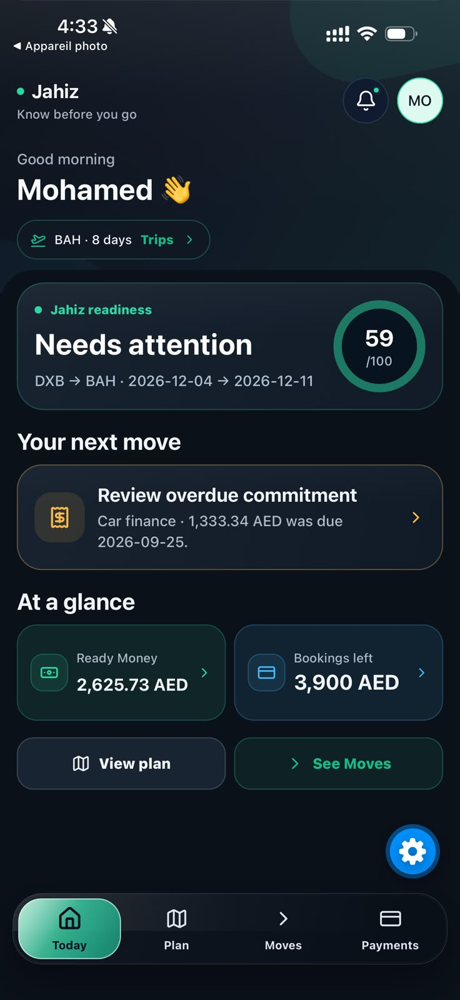
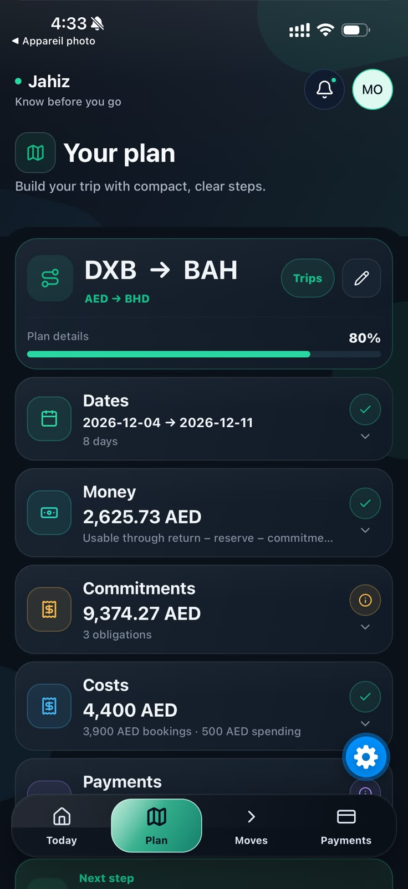
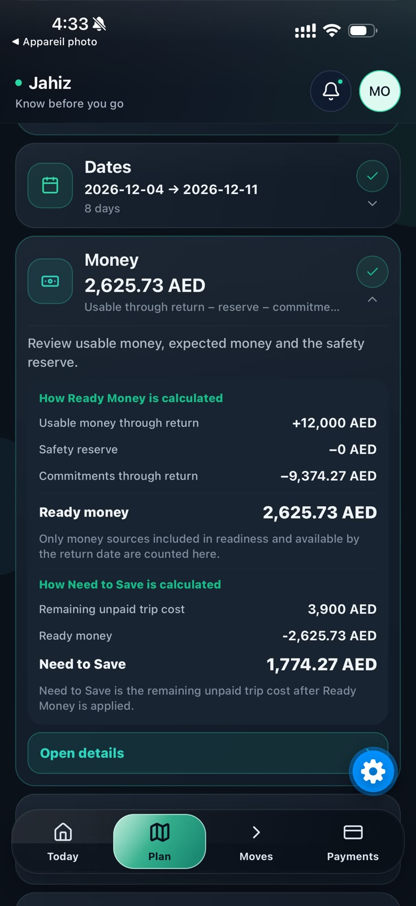
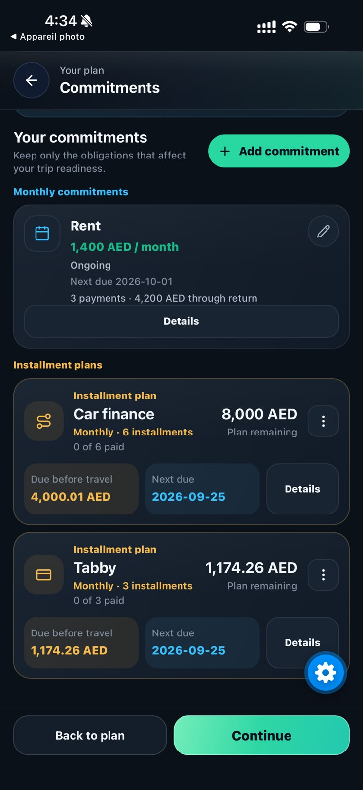
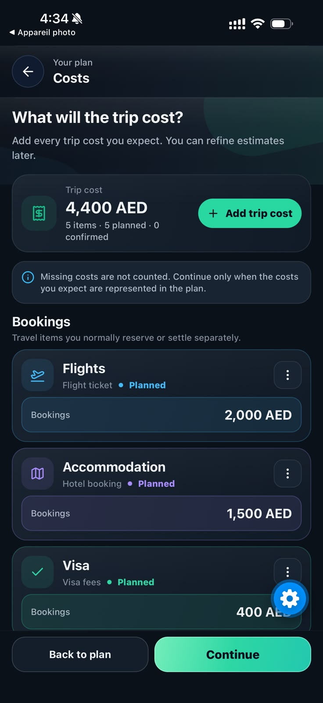
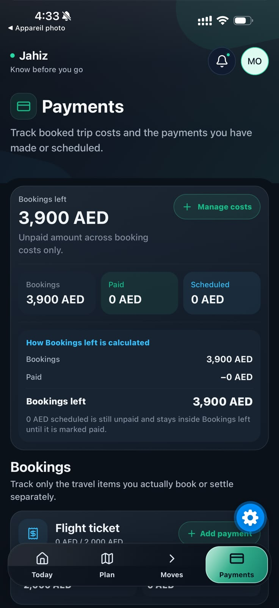
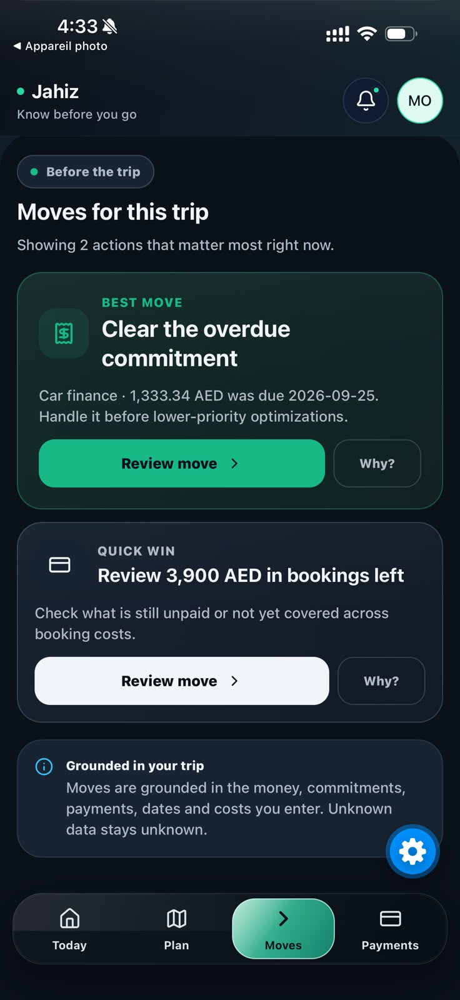

# Jahiz | جاهز

**A bilingual mobile platform for travel-readiness and financial decision-making.**

Jahiz helps travelers understand whether they are financially prepared for a trip, what is still missing, and what action to take next.

Instead of functioning as a simple trip budget tracker, Jahiz models money, commitments, trip costs, scheduled payments, timing, and readiness as one decision system.

> Current status: `0.1.0-alpha.6` — advanced pre-production alpha.

---

## Product Problem

Planning a trip is not only about knowing its total cost.

A traveler may have:

- money available now
- future salary or expected income
- recurring commitments
- installments
- partially paid bookings
- expenses due before or during the trip
- flexible travel dates

These values interact with each other and make a simple "budget remaining" number misleading.

Jahiz models these factors together to answer a more useful question:

**Can I realistically travel, and what should I do next?**

---

## Core Product Flow

1. Create or select a trip
2. Define route and travel dates
3. Add available and expected money
4. Record commitments and recurring obligations
5. Add estimated trip costs
6. Track booking payments
7. Calculate financial readiness
8. Surface the next actionable decision

The product supports multiple independent trips without mixing their financial data.

## Product Screenshots

<p align="center">
  
  
</p>

<p align="center">
  
  
</p>

<p align="center">
  
  
</p>

<p align="center">
  
</p>
## Key Features

### Travel workspace

Each trip maintains its own:

- route
- dates
- costs
- commitments
- payments
- money sources
- lifecycle state

### Financial readiness engine

Jahiz calculates readiness using deterministic financial rules rather than treating unknown values as zero.

The system distinguishes between:

- money available now
- expected money
- recurring income
- unpaid commitments
- paid commitments awaiting cash reconciliation
- planned trip costs
- partially paid costs
- scheduled payments

### Decision engine

The product determines the next relevant action based on the current trip state.

Examples include:

- complete missing trip information
- address an overdue commitment
- close a funding gap
- review an uncovered booking payment
- evaluate better travel timing

### Multi-trip architecture

Users can maintain several trips with isolated financial state, switch active trips, archive completed plans, and restore them later.

### Authentication & account isolation

The authentication architecture separates external identity-provider subjects from internal Jahiz user ownership.

Account data and local persistence are namespaced to prevent cross-account leakage.

### Conflict-safe synchronization

The synchronization model avoids automatic last-write-wins behavior.

When local and server versions diverge, Jahiz preserves both states and requires an explicit conflict-resolution decision.

### Arabic & English

The mobile experience supports both English and Arabic with RTL-aware product copy and internationalization contracts.

### Privacy-aware product metrics

Optional product analytics are designed around allowlisted interaction events and avoid serializing financial or identity payloads.

---

## Engineering Highlights

- TypeScript-first monorepo
- React Native + Expo mobile application
- Expo Router navigation
- Fastify API
- PostgreSQL persistence
- Clerk authentication integration
- Zod runtime contracts
- SecureStore-backed native persistence
- account-scoped local storage
- optimistic/concurrency-safe server revisions
- explicit synchronization conflict handling
- bilingual EN/AR internationalization
- deterministic financial domain logic
- automated regression and contract testing

---

## Architecture

```text
apps/
├── mobile/        React Native + Expo application
└── api/           Fastify API

packages/
├── api-contracts/ Shared runtime schemas and contracts
├── core-finance/  Financial calculation engine
├── design-tokens/ Shared visual system
├── i18n/          Arabic / English localization
└── ui/            Shared UI primitives

infrastructure/
└── Docker and deployment foundations

scripts/
└── Regression, contract, migration and integration tests

legacy/
└── Verified Safaryaty baseline retained for migration parity
